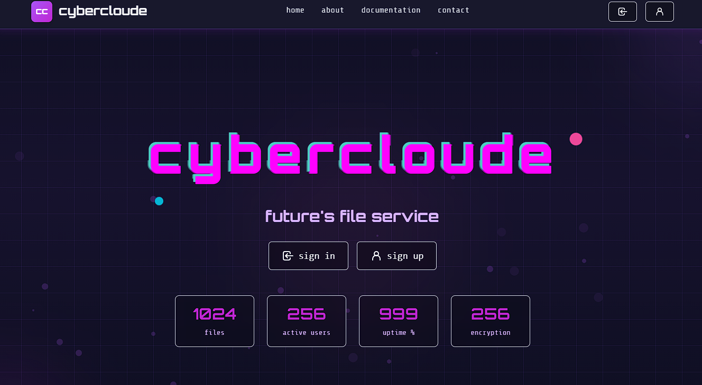
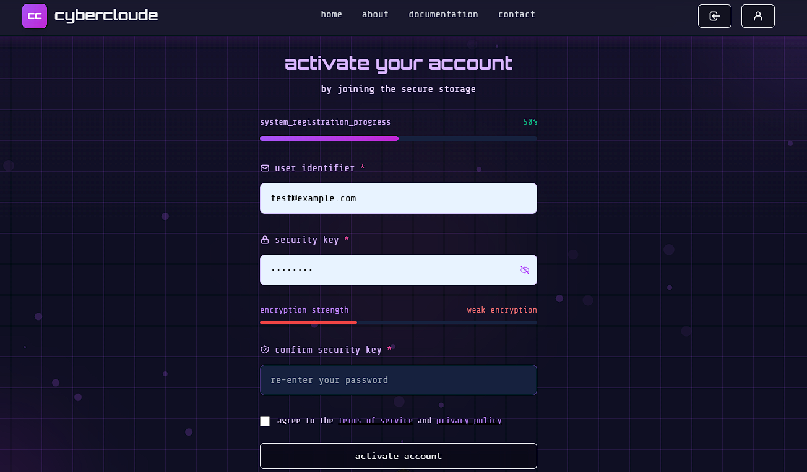
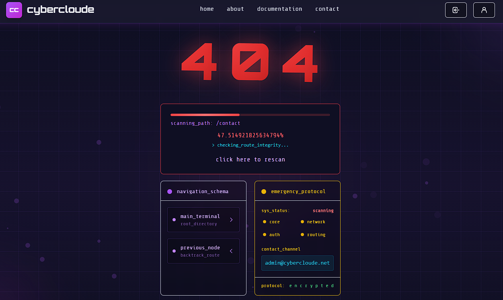

# 🌐 Cybercloude — Secure File Service

**Cybercloude** — это современный веб-сервис для безопасного хранения, обмена и управления файлами.  
Проект реализован на **Vue 3** с применением **TypeScript**, **Vite** и архитектуры, ориентированной на безопасность и масштабируемость.

---

## 🚀 Основные возможности

- 🔐 **Безопасное хранение данных** — файлы шифруются на стороне клиента перед загрузкой.
- 📂 **Загрузка и скачивание файлов** с проверкой подлинности пользователей.
- 👥 **Управление доступом** — разграничение прав между пользователями и организациями.
- 📱 **Адаптивный интерфейс** — удобен как для десктопа, так и для мобильных устройств.
- ⚙️ **Интеграция с REST API** — поддержка авторизации, токенов и сессий.

---

## 🧠 Технологический стек

| Категория | Технология |
|------------|-------------|
| **Frontend Framework** | [Vue 3](https://vuejs.org/) (Composition API) |
| **Build Tool** | [Vite](https://vitejs.dev/) |
| **Language** | TypeScript |
| **UI Framework** | [Tailwind CSS](https://tailwindcss.com/) |
| **State Management** | [Pinia](https://pinia.vuejs.org/) |
| **Routing** | [Vue Router](https://router.vuejs.org/) |
| **HTTP Client** | [Axios](https://axios-http.com/) |
| **Cryptography** | [crypto-js](https://www.npmjs.com/package/crypto-js) |
| **Linting / Formatting** | ESLint + Prettier |

---

## 💻 Скрипты

- bun run dev - запуск в режиме разработки
- bun run build - запуск сборки в продакшен

---

## 📸 Скриншоты

